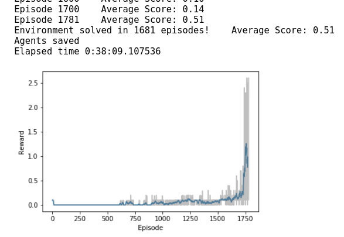

# Tennis project report.

In this paper we are going to do an analysis of the [Deep Deterministic Policy Gradient](https://arxiv.org/abs/1509.02971) algorithm in the Tennis environment of [Unity ML-Agents](https://github.com/Unity-Technologies/ml-agents) with the competition of 2 agents playing tennis.
To follow this project you can execute the python notebook [Tennis.ipynb](Tennis.ipynb). 
The first cell of the notebook is to set the environment plus some functions to make the code easier.
In the second code cell is where the agents are trained to learn the task acording with a certain hyperparameters.
The third and last cell is to see how the agents behave once trained.
The agents (2) are implemented in [Agents.py](Agents.py). This class depends on [ddpg.py](ddpg.py) and  [model.py](model.py). The first define one single agent following [DDPG algorithm](https://arxiv.org/abs/1509.02971) and the second define the network chosen for an agent.
It is considered that the agents have learned when they get a +0.5 combined reward for 100 episodes.

## 1.- First steps
The following hyperparameters are the starting point:
```
config= {
    "actor_lr": 0.001,
    "critic_lr": 0.001,
    "actor_nodes": [128, 128],
    "critic_nodes": [128, 128],
    "batch_size": 512,
    "memory_size": 100000,
    "discount": 0.9,
    "sigma": 0.1, # OUNoise
    "tau": 0.001,
}
```

## 2.- Hyperparameters selection

## 3.- Solution


<p align="center">
  
</p>

<p align="center">
  
</p>


## 4.- Conclusions

## 5.- Improvements
