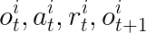
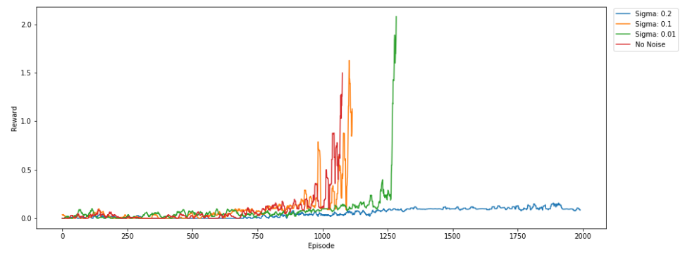
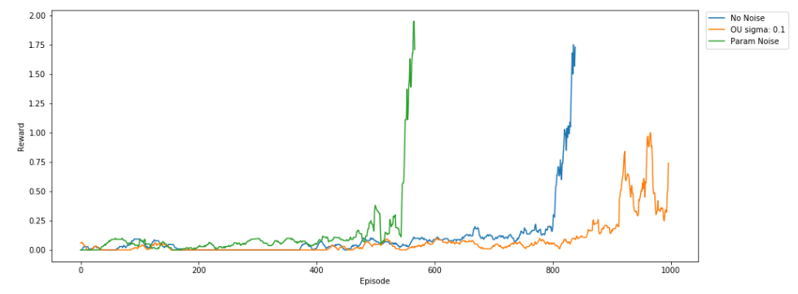
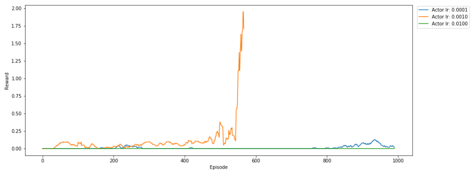
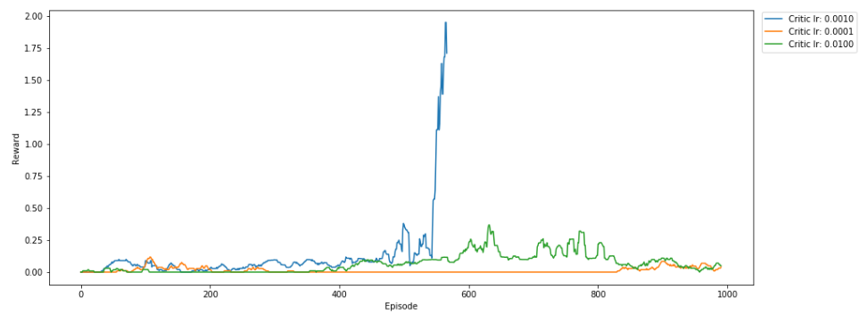
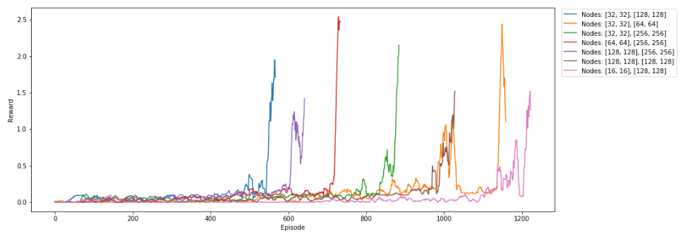
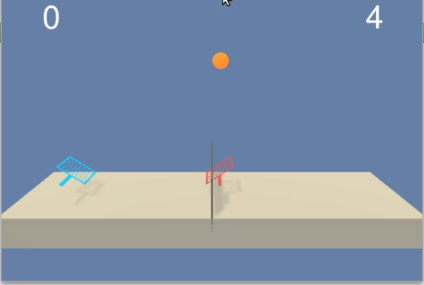

# Tennis project report.

In this paper we are going to do an analysis of the [Deep Deterministic Policy Gradient](https://arxiv.org/abs/1509.02971) algorithm in the Tennis environment of [Unity ML-Agents](https://github.com/Unity-Technologies/ml-agents) with the competition of 2 agents playing tennis.

To follow this project you can execute the python notebook [Tennis.ipynb](Tennis.ipynb). 
The first cell of the notebook is to set the environment plus some functions to make the code easier.
In the second code cell is where the agents are trained to learn the task acording with a certain hyperparameters.
The third and last cell is to see how the agents behave once trained.

The agents (2) are implemented in [Agents.py](Agents.py). This class depends on [ddpg.py](ddpg.py) and  [model.py](model.py). The first define one single agent following [DDPG algorithm](https://arxiv.org/abs/1509.02971) and the second define the network chosen for an agent.

[Agents.py] contiene la definicion de n agentes independientes que pueden aprender de su propia experiencia o de la experiencia de todos.
Veremos tres tipos de implementación:

1.- Cada agente aprende de su propia experiencia. 
<center> 
###o<sup>i</sup><sub>t</sub>, a<sup>i</sup><sub>t</sub>, r<sup>i</sup><sub>t</sub>, o<sup>i</sup><sub>t+1</sub> 
</center>.

<p align="center">
  
  <br>
</p>
Tambien he introducido otro enfoque para el ruido exploratorio tal como se sugiere en [Better Exploration with Parameter Noise](https://blog.openai.com/better-exploration-with-parameter-noise/).
Para ello sustituyo todos los Linear layers del actor por [NoisyLinear](https://github.com/jvmancuso/ParamNoise/blob/master/utils/noisy.py) layers como sugiere [jvmancuso](https://github.com/jvmancuso/ParamNoise/blob/master/utils/noisy.py).

It is considered that the agents have learned when they get a +0.5 combined reward for 100 episodes.

## 1.- First steps

I started out with the DDPG agent from a [previous project](https://github.com/gregoriomezquita/ml-agents/tree/master/Reacher).

Actor network consists of 3 fully connected layers with Relu activations and a final Tanh non-linear output.
```
Actor(
  (model): Sequential(
    (0): BatchNorm1d(24, eps=1e-05, momentum=0.1, affine=True, track_running_stats=True)
    (1): NoisyLinear (24 -> 32, Factorized: True)
    (2): ReLU()
    (3): BatchNorm1d(32, eps=1e-05, momentum=0.1, affine=True, track_running_stats=True)
    (4): NoisyLinear (32 -> 32, Factorized: True)
    (5): ReLU()
    (6): BatchNorm1d(32, eps=1e-05, momentum=0.1, affine=True, track_running_stats=True)
    (7): NoisyLinear (32 -> 2, Factorized: True)
    (8): Tanh()
  )
)
```
The Critic has also 3 fully connected layers with Relu activations.
```
Critic(
  (model_input): Sequential(
    (0): Linear(in_features=24, out_features=128, bias=True)
    (1): ReLU()
    (2): BatchNorm1d(128, eps=1e-05, momentum=0.1, affine=True, track_running_stats=True)
  )
  (model_output): Sequential(
    (0): Linear(in_features=130, out_features=128, bias=True)
    (1): ReLU()
    (2): Linear(in_features=128, out_features=1, bias=True)
  )
)
```


The following hyperparameters are the starting point:
```
config= {
    "actor_lr": 1e-3,
    "critic_lr": 1e-3,
    "actor_nodes": [32, 32],
    "critic_nodes": [128, 128],
    "batch_size": 256,
    "memory_size": 100000,
    "discount": 0.9,
    "tau": 0.001,
    "action_noise": "No",    # Options: No, Normal, OU, 
    "sigma": 0.1,            # OUNoise, Normal
    "critic_l2_reg": 0.0,  # 1e-2
}
```

## 2.- Hyperparameters selection
First we will start modifying the exploratory noise to know if it has as good result as in the [starting project](https://github.com/gregoriomezquita/ml-agents/tree/master/Reacher/Report.md).

It is important to point out that in order to compare the results it is necessary to reset the kernel of the notebook otherwise the seed of the environment is not the same.

<p align="center">
  
  <br>
  <em><b>Fig. 1: Self-experience Ornstein-Uhlenbeck noise comparation</b></em>
</p>


We can verify that the same result is produced as before: the agents learn faster without exploratory action noise (Ornstein-Uhlenbeck noise).
We also see that actor and critic's model definitions are valid in this case.
And finally, we see that agents are able to learn to compete only with their own experience.

What happens if we combine the experience of all the agents in such a way that each agent also learns from the experience of the others?

<p align="center">
  
  <br>
  <em><b>Fig. 2: Combined-experience noise comparison</b></em>
</p>

## 3.- Solution

<p align="center">
  
  <br>
  <em><b>Fig. 3: Diferent Actor learning rates</b></em>
</p>

<p align="center">
  
  <br>
  <em><b>Fig. 3: Diferent Critic learning rates</b></em>
</p>

<p align="center">
  
  <br>
  <em><b>Fig. 3: Diferent Actor-Critic node size</b></em>
</p>

<p align="center">
    
    <br>
    <em><b>Fig. 2: Solution behaviour</b></em>
</p>


## 4.- Conclusions

## 5.- Improvements
